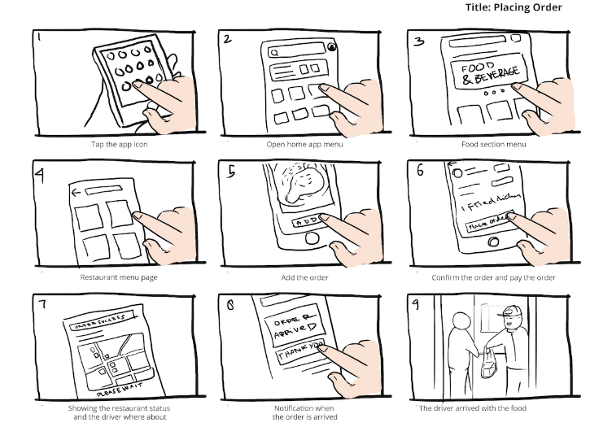
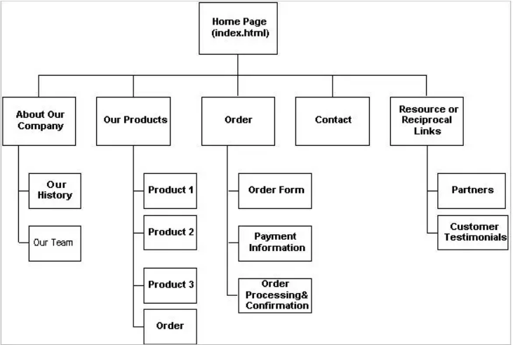

# Curriculum
The app track includes six dates in which participants are introduced to app development with Flutter and have the chance to support each other in app development. The following bullet points are intended to give an overview of the course and provide more information about the app development track.

#### 4.1 Kick-Off (02.11.2022)
We are excited to welcome you to the program! This will be your chance to get to know the fellow participants and form your group.

!!! todo "Sprint 0"
    
    - Watch:
        - Introduction (32 Minutes)
        - Learn The Kinds Of Problems To Solve With Design Thinking (41 Minutes)
        -Design Thinking Process (37 Minutes)
        - Design Thinking Stage 1 - Empathy (27 Minutes)
        - Empathy, Empathy, Empathy!! (1 Hour 14 Minutes)

#### 4.2 IT Project-Management Introduction (09.11.2022)
In this session you will gain first insights into the project and the design thinking framework. During the Intro Workshop, the Project Management Track starts with the first phase: Empathize. The goal is to create an understanding for the problems and challenges regarding the topic area. Connections are to be uncovered and understood, and stakeholders and their needs are to be identified. 
To understand the needs of your user group, you will interview fellow peers. During the session, we will discuss what aspects to pay attention to and you will have time to design the questionnaire.

[Here](https://miro.com/guides/ux-research/surveys-questions#example-questions) you can find tips on how to phrase your questions.
I would suggest that you create your questionnaire using [Google Forms](https://www.google.com/forms/about/) as google will automatically visualize your quantitative results. 
If you’d like to conduct in person interviews, [this](https://designsprintkit.withgoogle.com/methodology/phase1-understand/user-interviews) can help you.

!!! todo "Sprint 1"
    
    - Interview your peers (don't forget to document the answers!)
    - Analyze your interviews
    - Watch the following sections in preparation for the next tasks:
        - Design Thinking Stage 2 - Define (46 Minutes)
        - Learn User Journey Maps (43 Minutes)
        - Learn Point of View & The “How Might We” Method For Discovering Pain Points (35 Minutes)
        -Design Thinking Stage 3 - Ideation (37 Minutes)
        - Amazing Brainstorming For Ideas! (40 Minutes)
        - Learn About Selecting Solutions In Design Thinking (8 Minutes)

#### 4.3 First MeetUp (23.11.2022)
After analyzing the results of your interviews, you will define the main pain points of your target group. You can document these findings by creating [‘How Might We’- Statements](https://designsprintkit.withgoogle.com/methodology/phase1-understand/hmw-sharing-and-affinity-mapping). Remember your statements should focus on the users' needs and be phrased as an opportunity, not a solution. For example we as TechAcademy could ask ourselves: 

How might we motivate our participants to finish the semester program when unmotivated?

Of course you can also use other techniques, for example creating personas, which has been mentioned in the Udemy course.

Based on your core findings and the pain points of your target group, we move on to the ideation phase and start brainstorming. Here you should generate as many ideas as possible. In this phase quantity over quality applies. Feasibility and restrictions are disregarded for the time being. This is also called divergent thinking. 
After you have collected your ideas, you have to choose the best one. Which idea is feasible, which is realistic? Maybe you can combine some ideas? It is important that you document the decision process and explain why you have chosen your model as a press release. 
How this is supposed to look like and which questions should be answered you can find here: [https://designsprintkit.withgoogle.com/methodology/phase2-define/future-press-release](https://designsprintkit.withgoogle.com/methodology/phase2-define/future-press-release)

!!! todo "Sprint 2"
    
    - Finalize your idea (What should the app look like, what features does it contain?)
    - Take a look at the Figma section of this guideline.
        - Create your Figma Account and get a feel for the use of it.
    - Watch the following sections in preparation for the next tasks:
        - Desing Thinking Stage 4 - Prototyping

#### 4.4 Second MeetUp (14.12.2022)
In this meetup you will start creating your prototype. To make sure you have all main features included and know what the user experience is supposed to be like you can create a storyboard. In the storyboard you’ll map out the user's journey while using the app. More information here: [https://designsprintkit.withgoogle.com/methodology/phase5-prototype/storyboard](https://designsprintkit.withgoogle.com/methodology/phase5-prototype/storyboard)
Your story board could look like this:

It could also look like this:

You can find more examples here.
You can also use any other method you’ve gotten to know in the Udemy Course.

!!! todo "Sprint 3"
    
    - Watch the following sections:
        - Design Thinking Stage 5 - Testing
        - Looking Ahead To a Successful Implementation  Following Design Thinking (47 Minutes)
    

#### 4.5 Third MeetUp (11.01.2023)
In this meetup you will have time to continue working on your prototype in your groups. Additionally we will talk about your pitches. What does a good pitch entail and how do you structure it?

!!! todo "Sprint 4"
    
    - Finish your prototype
    - Test your prototype on potential users, gather feedback and adjust your prototype if necessary
    - Prepare your pitch

#### 4.6 Fourth MeetUp (01.02.2023)
Today is your big day! You will present your idea in front of the group and get some feedback.

!!! todo "Sprint 5"
    
    - Create the documentation of your approach in each phase and the key findings of each phase (max. 5 pages)
    - Submit the documentation and the link to your prototype

## Deadline: Hand-In on 04.02.2023 (11.59PM)

## Passing Criteria
To pass this course and get your certificate your group will have to:

- Go through and hand in a documentation of the key findings of each phase
- Create and hand in the prototype of your idea
- Pitch your idea (01.02.22)

Your documentation and the prototype have to be submitted to our email address ( projekt@tech-academy.io) before the deadline (04.02.2023).
It was very fun working with you this semester. 
Thank you for being part of TechAcademy!
